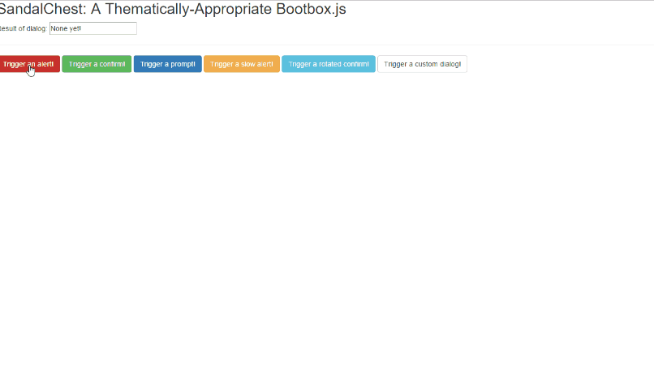

#Sandal Chest
##Thematically-Appropriate Bootbox

##Contents:

 - [What it is](#what-is-it)
 - [Installation](#installation)
 - [Usage](#usage)
 - [Custom Dialogs](#custom-dialogs)
 - [Examples](#examples)
 - [Credits](#credits)
 - [License](#license)

##What it is
If you're a web developer, you're probably familiar with the ubiquitous [Bootstrap](http://getbootstrap.com/). If you're not... where have you been? And if you're a dude like me that likes to churn out apps quickly and not spend too much time on styling, you're probably used to the amazing [Bootbox](http://bootboxjs.com/) library (which leverages bootstrap styling to make prettier alerts, confirms, etc.). 

That's great, but what if we don't want boostrappy-looking dialogs? What if we want something a little more Ye Olde looking for the epic browser game we're writing? Enter Sandal Chest, which is like your Grandma's version of bootbox.

##Installation
Install Sandal Chest is pretty simple. It's got three methods, and all you need to do is include the css (because this uses custom styling!) and js files to use them. So install with:

```bower install sandal-chest```

Then slap that js file into your html:

```<script src="./sandal-chest/sandal-chest.js"></script>```

And finally squeeze that css in there too:

```<link rel="stylesheet" type="text/css" href="./sandal-chest/sandal-chest.css">```

You'll also need a few external files, including jQuery and Bootstrap. But know you, you probably already had those in your project anyway.

##Usage
Once you've included the files above in your HTML, call them at any point in your JS by just running:

`sandalchest.alert(args)`

or

`sandalchest.confirm(args)`

or

`sandalchest.prompt(args)`

You'll need to give Sandal Chest at least one argument if you want it to actually do anything. Note that these are all optional.
 - A title for your dialog. That's 'Alerts are cool!' in the screenie below.
 - Some text for your dialog. That's 'All the cool kids are using alerts!' in the screenie below.
 - A callback function. If you use `sandalchest.prompt()` or `sandalchest.confirm()`, your input will be passed to this function. 
 - An options object (see below);

These can be included in any order. However, there are a few specifics:

 1. The first argument of type 'string' will be treated as the title, and the second will be treated as the main text.
 2. If you supply more than the maximum number of arguments of a type (so, more than 2 strings, or more than 1 function or object), Sandal Chest will throw an error.
 3. Again, these are all optional. 
  - Not supplying the title will default it to 'Untitled'. 
  - Not supplying the text will default it to 'No content!'.
  - Not supplying the options object will run the function with default options (speed of 1s, rotation offset of 2 degrees).

The options object has three options: Speed, rotation, and buttons. The defaults for the speed and rotation are 1000ms and 2 degrees, but they can be changed by passing something like `{speed:3000,rotation:20}` to the function to, for example, run a dialog with a 3-second intro duration, and a rotation of 20 degrees. The buttons option is explained below.

Here's a nice screenshot for you:


##Custom Dialogs
Sandal-chest can also do custom dialogs (with custom HTML!). This allows you to specify custom elements (such as fields), as well as buttons, each with its own behavior. The buttons generally follow the Bootbox model, with some minor changes:

    buttons:[{
    	text:'Hi',
    	close:true,
    	click:function(){
    		//do some stuff!
    	}
    },{
    	text:'Nevermind...',
    	close:false,
    	click:function(){
    		//erase some stuff!
    	}
    }]

The properties should be pretty self-explanatory, but they are as follows:

 - text: What the button says.
 - close: If true (or truthy), closes the box when this button is pressed. Set to false if this is like a 'clear form' button or something.
 - click: the callback function that's run when this button is pressed. 

Custom dialogs MUST be passed at least one button, and they must include both body text and title text,

##Examples
I've included an HTML file in the `./tests/` folder if you want to see an example of each of the functions.

##Credits
 - Firstly, and most importantly, credit is due to the incredible folks over at [Bootbox](http://bootboxjs.com/), including [Nick Payne](http://twitter.com/makeusabrew). Their stuff is awesome: I'm just piggybacking off of it.
 - Secondly, I owe a lot of the styling to bootstrap. So yeh, those dudes are awesome too.
 - Finally, the coding for Sandal Chest itself was done by me, [David Newman](https://github.com/Newms34/)

##License
Since I did not develop either Bootstrap or Bootbox, I have no control over those licenses. As far as Sandal Chest, however, you're free to redistribute/use it however you like. 
